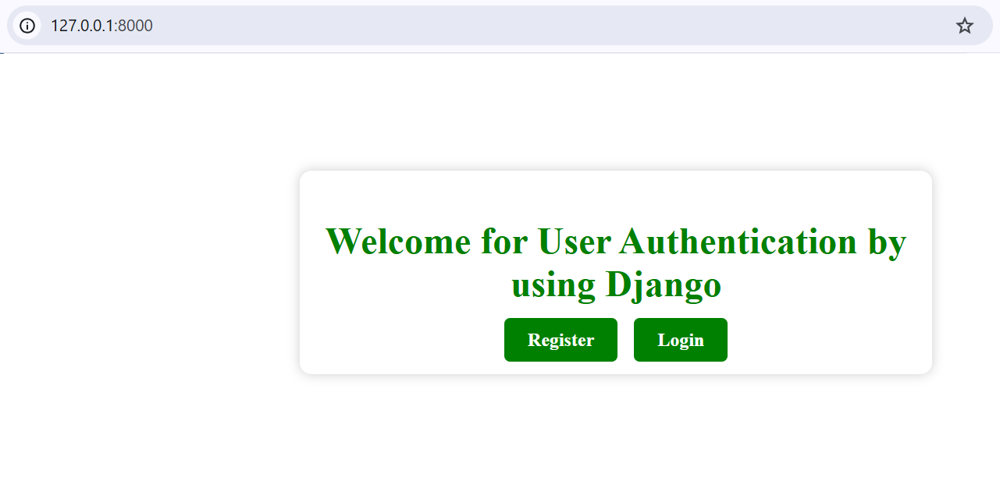
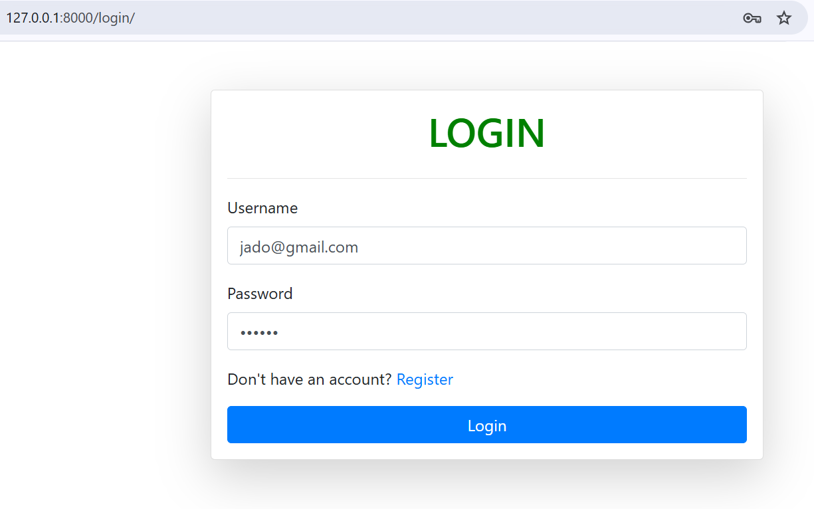
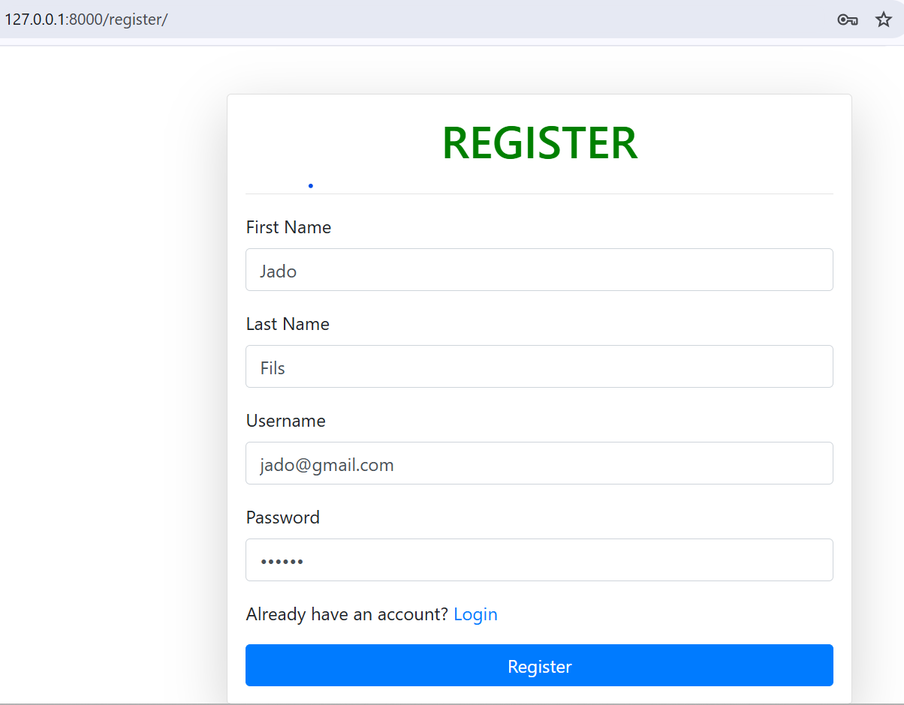
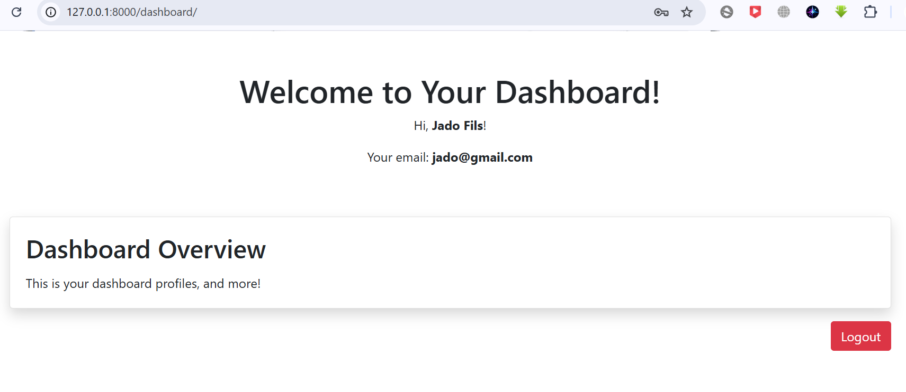

<<<<<<< HEAD
# Registration and Login System in Django

This project implements a user registration and login system using the Django framework. It allows users to register, log in, access a dashboard (protected by authentication), and log out. The project is designed to be simple yet powerful, with clean UI elements and robust authentication mechanisms.

## Features
- **User Registration**: New users can create accounts by providing their first name, last name, username, and password.
- **User Login**: Existing users can log in with their credentials.
- **Authenticated Dashboard**: Users can access a personalized dashboard after logging in.
- **Logout Functionality**: Users can securely log out from the system.
- **Error Handling**: Displays appropriate error messages for invalid inputs or authentication failures.
- **Responsive UI**: Built with Bootstrap for a clean and modern design.

## Screenshots
- **Home Page**
   
- **Login Page**: Simple login form with error handling.
    
- **Registration Page**: Create a new user account with form validation.
   
- **Dashboard**: Personalized welcome message with user details (name and email).


## Technologies Used
- **Backend**: Django (Python)
- **Frontend**: HTML, CSS, Bootstrap
- **Database**: SQLite (default Django database)
- **Authentication**: Django's built-in auth system

## Installation
Follow these steps to set up and run the project locally:

### 1. Clone the Repository
```bash
git clone https://github.com/Trtheo/Regiser_Login_Auth_Django.git
cd Regiser_Login_Auth_Django
```

### 2. Create a Virtual Environment
```bash
python -m venv venv
source venv/bin/activate  # On macOS/Linux
venv\Scripts\activate     # On Windows
```

### 3. Install Dependencies
```bash
pip install -r requirements.txt
```

### 4. Run Database Migrations
```bash
python manage.py migrate
```

### 5. Create a Superuser (Admin)
```bash
python manage.py createsuperuser
```
Follow the prompts to create an admin account.

### 6. Run the Development Server
```bash
python manage.py runserver
```
Visit [http://127.0.0.1:8000/](http://127.0.0.1:8000/) in your browser.

## Usage
1. **Access Home Page**: Navigate to the home page and choose to log in or register.
2. **Register a New Account**: Go to `/register/` and create a new account.
3. **Log In**: Use your credentials to log in at `/login/`.
4. **Dashboard**: Access your personalized dashboard at `/dashboard/`.
5. **Log Out**: Securely log out by clicking the "Logout" button.


## Contributing
Contributions are welcome! If you'd like to contribute:
1. **Fork the repository**.
2. **Create a new branch**:
   ```bash
   git checkout -b feature/your-feature-name
   ```
3. **Commit your changes**:
   ```bash
   git commit -m 'Add some feature'
   ```
4. **Push to the branch**:
   ```bash
   git push origin feature/your-feature-name
   ```
5. **Submit a pull request**.


## Contact
For questions or suggestions, feel free to reach out:
- **Email**: niyigabatheo10@gmail.com
- **GitHub**: [yourusername](https://github.com/Trtheo)

=======
# Registration and Login System in Django

This project implements a user registration and login system using the Django framework. It allows users to register, log in, access a dashboard (protected by authentication), and log out. The project is designed to be simple yet powerful, with clean UI elements and robust authentication mechanisms.

## Features
- **User Registration**: New users can create accounts by providing their first name, last name, username, and password.
- **User Login**: Existing users can log in with their credentials.
- **Authenticated Dashboard**: Users can access a personalized dashboard after logging in.
- **Logout Functionality**: Users can securely log out from the system.
- **Error Handling**: Displays appropriate error messages for invalid inputs or authentication failures.
- **Responsive UI**: Built with Bootstrap for a clean and modern design.

## Screenshots
- **Home Page**
- **Login Page**: Simple login form with error handling.
- **Registration Page**: Create a new user account with form validation.
- **Dashboard**: Personalized welcome message with user details (name and email).

## Technologies Used
- **Backend**: Django (Python)
- **Frontend**: HTML, CSS, Bootstrap
- **Database**: SQLite (default Django database)
- **Authentication**: Django's built-in auth system

## Installation
Follow these steps to set up and run the project locally:

### 1. Clone the Repository
```bash
git clone https://github.com/yourusername/your-repository.git
cd your-repository
```

### 2. Create a Virtual Environment
```bash
python -m venv venv
source venv/bin/activate  # On macOS/Linux
venv\Scripts\activate     # On Windows
```

### 3. Install Dependencies
```bash
pip install -r requirements.txt
```

### 4. Run Database Migrations
```bash
python manage.py migrate
```

### 5. Create a Superuser (Admin)
```bash
python manage.py createsuperuser
```
Follow the prompts to create an admin account.

### 6. Run the Development Server
```bash
python manage.py runserver
```
Visit [http://127.0.0.1:8000/](http://127.0.0.1:8000/) in your browser.

## Usage
1. **Access Home Page**: Navigate to the home page and choose to log in or register.
2. **Register a New Account**: Go to `/register/` and create a new account.
3. **Log In**: Use your credentials to log in at `/login/`.
4. **Dashboard**: Access your personalized dashboard at `/dashboard/`.
5. **Log Out**: Securely log out by clicking the "Logout" button.

## Security Tips
- Use environment variables (`.env`) to store sensitive information, such as `SECRET_KEY`.
- Add `.env` and other sensitive files (e.g., `db.sqlite3`) to `.gitignore` to prevent exposing them on public repositories.
- Implement **HTTPS** for production environments.

## Contributing
Contributions are welcome! If you'd like to contribute:
1. **Fork the repository**.
2. **Create a new branch**:
   ```bash
   git checkout -b feature/your-feature-name
   ```
3. **Commit your changes**:
   ```bash
   git commit -m 'Add some feature'
   ```
4. **Push to the branch**:
   ```bash
   git push origin feature/your-feature-name
   ```
5. **Submit a pull request**.

## License
This project is licensed under the **MIT License**. You are free to use, modify, and distribute this project as long as proper credit is given.

## Contact
For questions or suggestions, feel free to reach out:
- **Email**: your-email@example.com
- **GitHub**: [yourusername](https://github.com/yourusername)

>>>>>>> cc59df177dfdbd7bababa987186d4d08248a6666
